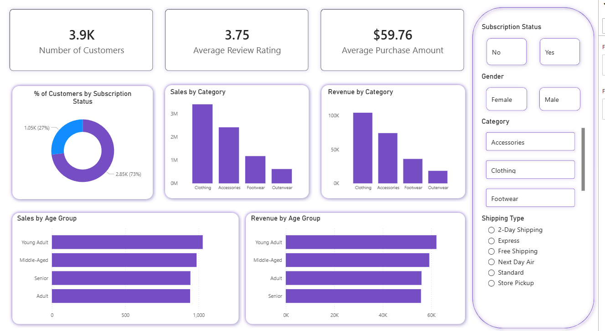
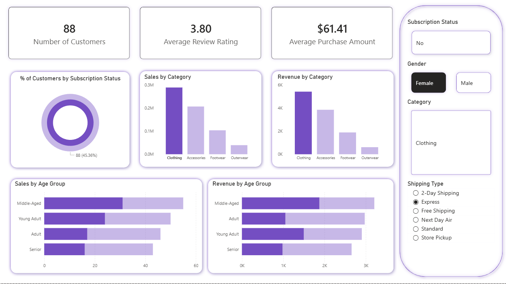
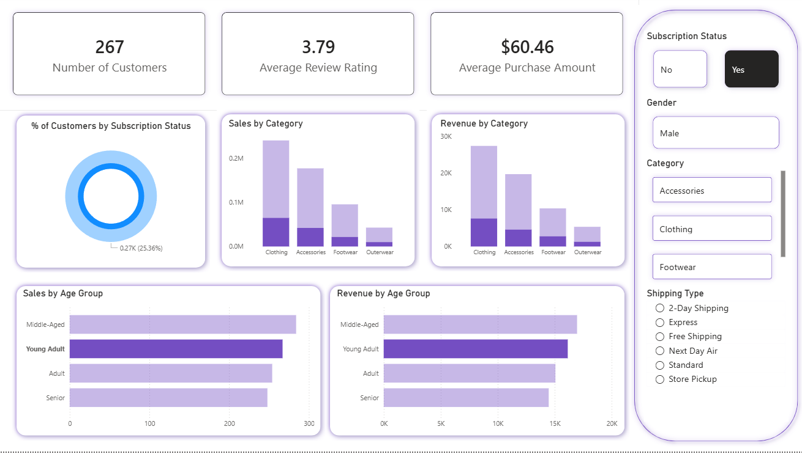

# Customer Shopping Behavior Analysis
## Overview

This project demonstrates a complete data analytics workflow using Python, SQL, and Power BI. The objective of the project is to analyze raw data, extract meaningful insights, and present the results through interactive dashboards and reports.

The project includes:

- Data loading and preprocessing
- Exploratory Data Analysis (EDA)
- Data cleaning and transformation
- SQL analysis using PostgreSQL/MySQL/SQL Server
- Power BI dashboard creation
- Report and presentation development using Gamma

## Dataset

The dataset contains structured business-related data used for analysis and visualization. Various preprocessing techniques were applied to improve data quality and accuracy before analysis.

## Tools & Technologies

- Python – Pandas, NumPy, Matplotlib, Seaborn
- SQL – PostgreSQL, MySQL, SQL Server
- Power BI – Dashboard and visualization
- Jupyter Notebook / VS Code – Development environment
- Gamma AI – Presentation creation

## Project Workflow

### 1. Data Loading
- Imported dataset using Pandas
- Checked dataset structure and datatypes

### 2. Exploratory Data Analysis (EDA)
- Analyzed trends, patterns, and distributions
- Created charts and visualizations for better insights

### 3. Data Cleaning
- Handled missing values
- Removed duplicates
- Corrected inconsistent data
- Formatted columns and datatypes

### 4. SQL Analysis

Performed SQL queries for:

- Data filtering and sorting
- Aggregations and grouping
- Joins and subqueries
- KPI extraction

### 5. Power BI Dashboard

Built an interactive dashboard with:

- KPI cards
- Charts and graphs
- Filters and slicers
- Trend analysis

### Desktop View

## Results

The project helped identify important business insights and trends through data visualization and SQL analysis. The dashboard and reports improved understanding of the dataset and supported data-driven decision-making.

## How to Run the Project

### Install Required Libraries

pip install pandas numpy matplotlib seaborn

### Run the Notebook

jupyter notebook

### Open Dashboard

Download the .pbix file and open it in Power BI Desktop to explore the interactive dashboard.

## Project Structure

- customer_behavior.pbix - PowerBI dashboard
- Customer_Behavior_Analysis.ipynb - Python analysis
- customer_behavior_dataset.sql - MySQL database dump
- customer_behavior_analysis_queries.sql - MySQL queries
- Customer_Behavior_Analysis_Report.pdf - PDF report with findings
- Customer-Shopping-Behavior-Analysis.pptx - Presentation
- screenshorts/ - Dashboard images

## Skills Demonstrated

- Data Cleaning & Preprocessing
- Exploratory Data Analysis (EDA)
- SQL Querying
- Data Visualization
- Dashboard Development
- Business Reporting & Presentation

## Conclusion

This project showcases an end-to-end data analytics process from raw data handling to visualization and reporting using Python, SQL, and Power BI.

